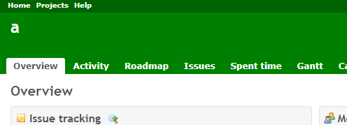
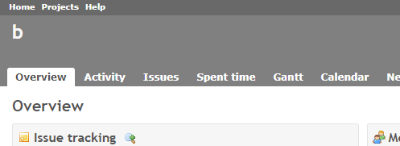

# Change the color of the header for each project

Change the color of the header for each project to help you know which project you are viewing.  
プロジェクト毎にヘッダの色を変えることで、どのプロジェクトを表示しているかわかりやすくします。

## Setting

### Path Pattern

None

### Project Pattern

None

### Insert Position

Head of all pages
<!-- 
Head of all pages
Bottom of issue form
Bottom of issue detail
Bottom of all pages
-->

### Code

CSS
<!--
JavaScript
CSS
HTML
-->

```css
body.project-a #top-menu {
  background-color: #006400; /* dark green */
}
 
body.project-a #header {
  background-color: #008000; /* green */
}

body.project-b #top-menu {
  background-color: #696969; /* dimgray */
}
 
body.project-b #header {
  background-color: #808080; /* gray */
}
```

## Result



