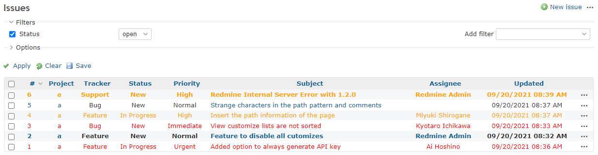

# Decorate the issue list

Decorate the issue list.  
チケット一覧を装飾します。

* Bold font the issue that you are in assign of.  
自分が担当のチケットは太字にする。
* Change colors according to priority.  
優先度に応じて色を変える。

## Setting

### Path Pattern

`/issues$`

### Insert Position

Head of all pages
<!-- 
Head of all pages
Bottom of issue form
Bottom of issue detail
Bottom of all pages
-->

### Code

CSS
<!--
JavaScript
CSS
HTML
-->

```css
tr.issue.assigned-to-me {
  font-weight: bold;
}

tr.issue.priority-highest,
tr.issue.priority-highest a,
tr.issue.priority-highest a:link,
tr.issue.priority-highest a:visited {
  color: red;
}

tr.issue.priority-high2,
tr.issue.priority-high2 a,
tr.issue.priority-high2 a:link,
tr.issue.priority-high2 a:visited {
  color: red;
}

tr.issue.priority-high3,
tr.issue.priority-high3 a,
tr.issue.priority-high3 a:link,
tr.issue.priority-high3 a:visited {
  color: orange;
}
```

## Result



## Note

The issue list has class attribute set according to the content of the issue, so you can easily decorate it.  
チケット一覧には、チケットの内容に応じたクラス属性が設定されているので、簡単に装飾することができます。

* tracker-{Tracker ID}  
`tracker-1` `tracker-2`
* status-{Status ID}  
`status-1` `status-2`
* priority-{Priority ID}  
`priority-1` `priority-2`
* priority-{Priority Type}  
`priority-lowest` `priority-default` `priority-high3` `priority-high2` `priority-highest`
* `created-by-me` 
* `assigned-to-me` 
* `closed` 
