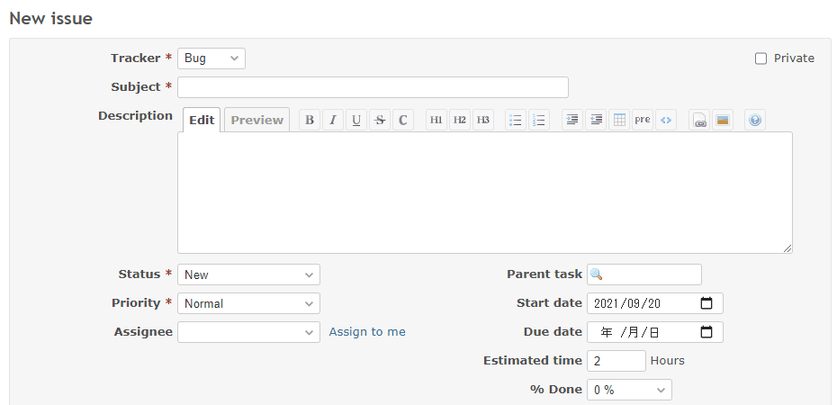

# Set the default value by tracker

Set the default value by tracker when creating a issue.  
チケット作成時にトラッカーに応じてデフォルト値を設定します。

## Setting

### Path Pattern

None

### Insert Position

Bottom of issue form
<!-- 
Head of all pages
Bottom of issue form
Bottom of issue detail
Bottom of all pages
-->

### Code

JavaScript
<!--
JavaScript
CSS
HTML
-->

```javascript
$(function() {

  if (!$('form').hasClass('new_issue')) {
    // Do not process on edit
    return;
  }

  // Estimated time, Assignee
  switch($('#issue_tracker_id').val()) {
    case '1':
      $('#issue_estimated_hours').val('2');
      $('#issue_assigned_to_id').val('');
      break;

    case '2':
      $('#issue_estimated_hours').val('4');
      $('#issue_assigned_to_id').val('1');
      break;

    case '3':
      $('#issue_estimated_hours').val('1');
      $('#issue_assigned_to_id').val('6');
      break;
  }
});
```

## Result



