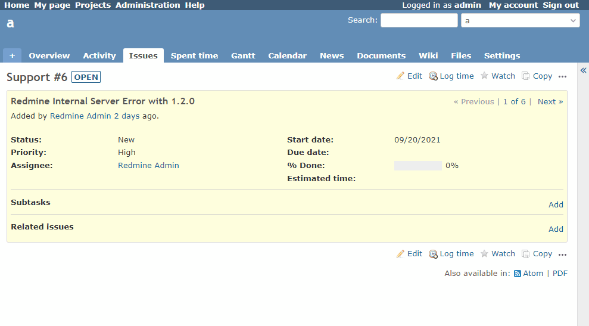

# Toggle the display of the sidebar

Toggle the display of the sidebar.
The default is to hide it.  
サイドバーの表示・非表示を切り替え可能にします。
デフォルトは非表示です。

## Setting

### Path Pattern

None

### Insert Position

Head of all pages
<!-- 
Head of all pages
Bottom of issue form
Bottom of issue detail
Bottom of all pages
-->

### Code

JavaScript
<!--
JavaScript
CSS
HTML
-->

```javascript
$(function() {

  const toggleButton = $('<a id="sidebar_button" href="#">&raquo;</a>')
    .css({
      'display': 'block',
      'font-size': '20px',
    });

  const wrapper = $('<div></div>')
    .append(toggleButton)
    .css({
      'float': 'left',
      'margin-left': '-17px',
    });

  const sidebar = $('#sidebar').prepend(wrapper);

  let isOpen = true;

  const toggle = function() {
    isOpen = !isOpen;

    if (isOpen) {
      // close -> open
      toggleButton.html('&raquo;');

      sidebar.css({
        'width': '',
        'padding-right': ''
      });

      wrapper.nextAll().show();

    } else {
      // open -> close
      toggleButton.html('&laquo;');

      sidebar.css({
        'width': '0',
        'padding-right': '0'
      });

      wrapper.nextAll().hide();
    }
  }

  toggleButton.on('click', toggle);

  // default close
  toggle();
});
```

## Result



