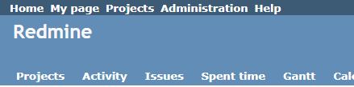
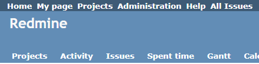

# Add all issues link on header

Add a link to the list of all issues on the header.  
全チケット一覧へのリンクをヘッダに追加します。

## Setting

### Path Pattern

None

### Insert Position

Head of all pages
<!-- 
Head of all pages
Bottom of issue form
Bottom of issue detail
Bottom of all pages
-->

### Code

JavaScript
<!--
JavaScript
CSS
HTML
-->

```javascript
$(function() {
  $('#top-menu > ul')
    .append('<li><a href="/issues">All Issues</a></li>');
});
```

## Result

### Before



### After



