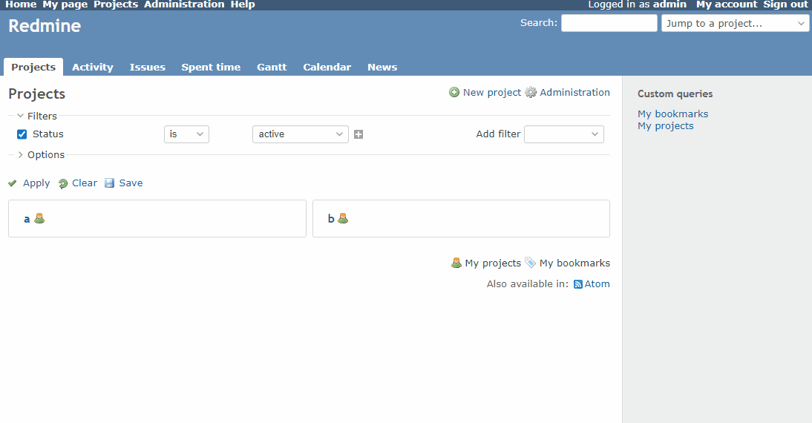

# Change project link url

Change the URL of the link to each project in the project list.  
プロジェクト一覧の各プロジェクトへのリンクのURLを変更します。

In this example, change to the issues list.  
このページの例では、チケット一覧に変更します。

## Setting

### Path Pattern

`/projects$`

### Insert Position

Head of all pages
<!-- 
Head of all pages
Bottom of issue form
Bottom of issue detail
Bottom of all pages
-->

### Code

JavaScript
<!--
JavaScript
CSS
HTML
-->

```javascript
$(function() {
  // Change URL to issues list
  $('#projects-index a.project').each(function() { this.href += '/issues' });
})
```

## Result



