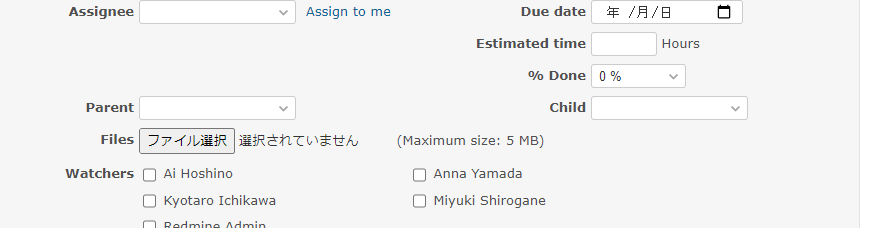

# Link custom fields

Narrows down the choices of the child custom fields according to the value of the parent custom field.  
親のカスタムフィールドの値に応じて、子のカスタムフィールドの選択肢を絞ります。

## Setting

### Path Pattern

None

### Insert Position

Bottom of issue form
<!-- 
Head of all pages
Bottom of issue form
Bottom of issue detail
Bottom of all pages
-->

### Code

JavaScript
<!--
JavaScript
CSS
HTML
-->

```javascript
$(function() {

  // Note: Change the ID according to the custom field you want to target.
  const parentFieldId = 'issue_custom_field_values_1';
  const childFieldId = 'issue_custom_field_values_2';

  const isTarget = function(child, parent) {
    if (child.val() === '') {
      // Unselect is always target
      return true;
    }

    // forward match
    return child.text().indexOf(parent.text()) == 0;
  }

  const narrowChildField = function() {

    const parentSelected = $('#' + parentFieldId + ' > option:selected');

    $('#' + childFieldId + ' > option').each(function() {

      const child = $(this);

      // Narrow down by match.
      // (In IE, option is not hidden by "display:none", so "disabled" it to make it unselectable.)
      if (isTarget(child, parentSelected)) {
        child.show();
        child.prop('disabled', false);
      } else {
        child.hide();
        this.selected = false;
        child.prop('disabled', true);
      }
    });
  }

  $('#' + parentFieldId).on('change', narrowChildField);

  narrowChildField();
});
```

## Result


