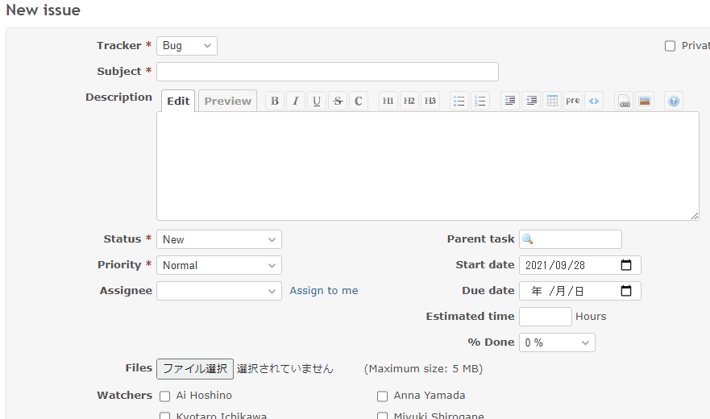

# Change the visibility of custom fields by status

Change the visibility of custom fields by status.  
ステータス毎にカスタムフィールドの表示/非表示を切り替えます。

In this example, the custom field 1 will be displayed only if the status ID is 2.  
この例では、ステータスIDが2の場合のみ、カスタムフィールド1が表示します。

## Setting

### Path Pattern

None

### Insert Position

Bottom of issue form
<!-- 
Head of all pages
Bottom of issue form
Bottom of issue detail
Bottom of all pages
-->

### Code

JavaScript
<!--
JavaScript
CSS
HTML
-->

```javascript
$(function() {

  const targetCustomFieldId = '1';

  const targetCustomFieldInput = $('#issue_custom_field_values_' + targetCustomFieldId);
  const targetCustomFieldDisplay = $('div.cf_' + targetCustomFieldId + '.attribute');

  const visible = $('#issue_status_id').val() == '2';

  if (visible) {
    targetCustomFieldInput.parent().show();
    targetCustomFieldDisplay.show();
  } else {
    targetCustomFieldInput.parent().hide();
    targetCustomFieldDisplay.hide();
  }
});
```

## Result


