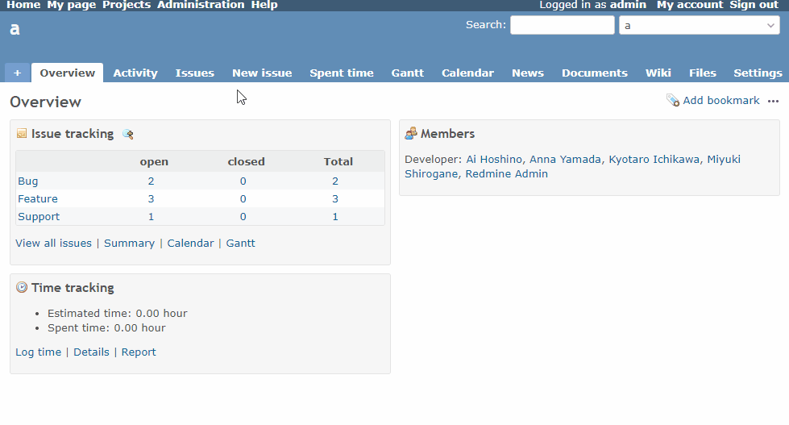

# Add a new Issue tab

Add a new Issue tab.  
新しいチケットタブを追加します。

In the Redmine settings, you can only show either the new Issue tab or the "+" button, but this setting allows you to show both.  
Redmineの設定では、新しいチケットタブか"+"ボタンのどちらかしか表示できませんが、この設定により、両方を表示することができます。

## Setting

### Path Pattern

None

### Insert Position

Head of all pages
<!-- 
Head of all pages
Bottom of issue form
Bottom of issue detail
Bottom of all pages
-->

### Code

JavaScript
<!--
JavaScript
CSS
HTML
-->

```javascript
$(function() {
  const newIssueSub = $('.menu-children a.new-issue-sub');

  if (newIssueSub.size() == 1) {
    // When "New Issue" exists in the "+" button, add it to the tab as well
    $('#main-menu > ul > li > a.issues').parent()
      .after($('<li>').append(newIssueSub.clone().attr('class', 'new-issue')));

    if (location.pathname == newIssueSub.attr('href')) {
      // Switch the selection to the "New Issue" tab
      $('#main-menu > ul > li > a.issues').removeClass('selected');
      $('#main-menu > ul > li > a.new-issue').addClass('selected');
    }
  }
});
```

## Result


