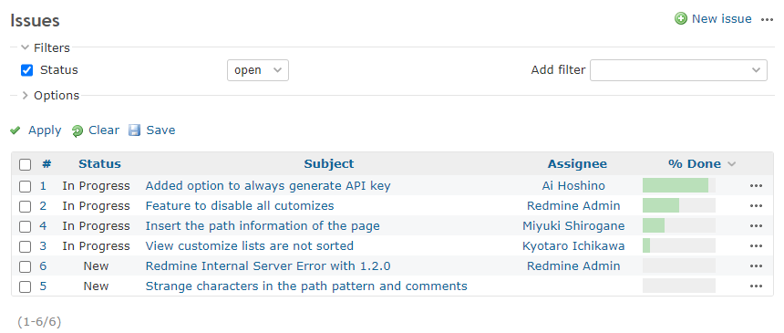
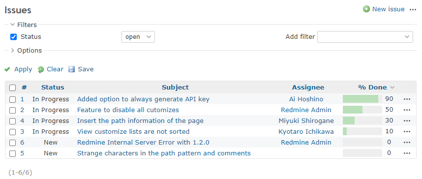

# Add a progress value to the issue list

Add a progress value to the issue list.  
チケット一覧に進捗の値を追加します。

## Setting

### Path Pattern

`/issues$`

### Insert Position

Head of all pages
<!-- 
Head of all pages
Bottom of issue form
Bottom of issue detail
Bottom of all pages
-->

### Code

JavaScript
<!--
JavaScript
CSS
HTML
-->

```javascript
$(function() {
  $('table.progress').each(function() {
    const target = $(this);

    // Get the value of progress from class name
    // (ex. progress-10)
    const match = target.attr('class').match(/progress-([0-9]+)/);
    if (!match) {
      return;
    }

    var value = match[1];
    target.after($('<span>').text(value));
  });
});
```

## Result

### Before




### After


