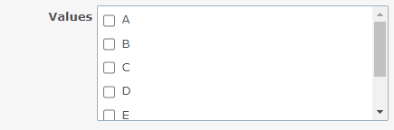

# Display custom field checkboxes in two columns

Display custom field checkboxes in two columns.  
カスタムフィールドのチェックボックスを2列で表示します。

## Setting

### Path Pattern

None

### Insert Position

Bottom of issue form
<!-- 
Head of all pages
Bottom of issue form
Bottom of issue detail
Bottom of all pages
-->

### Code

CSS
<!--
JavaScript
CSS
HTML
-->

```css
span.enumeration_cf.check_box_group {
  column-count: 2;
}
```

## Result

### Before



### After


