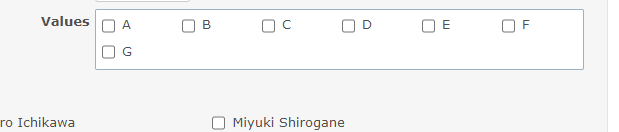

# Display custom field checkboxes horizontally

Display custom field checkboxes horizontally.  
カスタムフィールドのチェックボックスを横並びに表示します。

## Setting

### Path Pattern

None

### Insert Position

Bottom of issue form
<!-- 
Head of all pages
Bottom of issue form
Bottom of issue detail
Bottom of all pages
-->

### Code

CSS
<!--
JavaScript
CSS
HTML
-->

```css
span.enumeration_cf.check_box_group {
  display: flex;
  flex-wrap: wrap; 
}

/* fix width */
span.enumeration_cf.check_box_group label {
  width: 80px;
}
```

## Result


