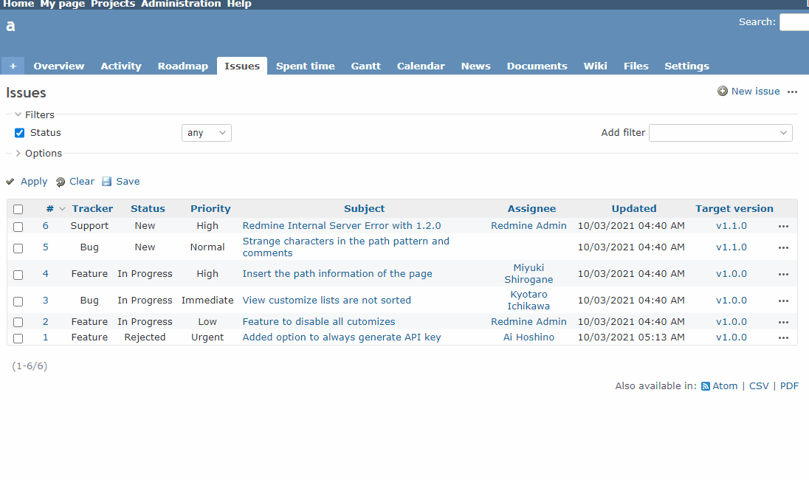

# Change the version when the status is changed from the context menu

Change the version when the status is changed from the context menu of the issue list.  
チケット一覧のコンテキストメニューからステータスを変更した際に、バージョン番号も変更します。

In this example, if you change the status ID to 6, the target version will be unset.  
この例では、ステータスIDを6に変更すると、対象バージョンが未設定になります。

## Setting

### Path Pattern

`/issues$`

### Insert Position

Head of all pages
<!-- 
Head of all pages
Bottom of issue form
Bottom of issue detail
Bottom of all pages
-->

### Code

JavaScript
<!--
JavaScript
CSS
HTML
-->

```javascript
$(function() {

  // Replace the show function in jQuery to add processing when the context menu is shown
  jQuery.fn._show = jQuery.fn.show;

  jQuery.fn.show = function() {
    if (this.attr('id') == 'context-menu') {
      const a = $('#context-menu a[href*="status_id%5D=6"]');
      a.attr('href', a.attr('href') + '&issue%5Bfixed_version_id%5D=none');
    }

    return jQuery.fn._show.apply(this, arguments);
  };
});
```

## Result


