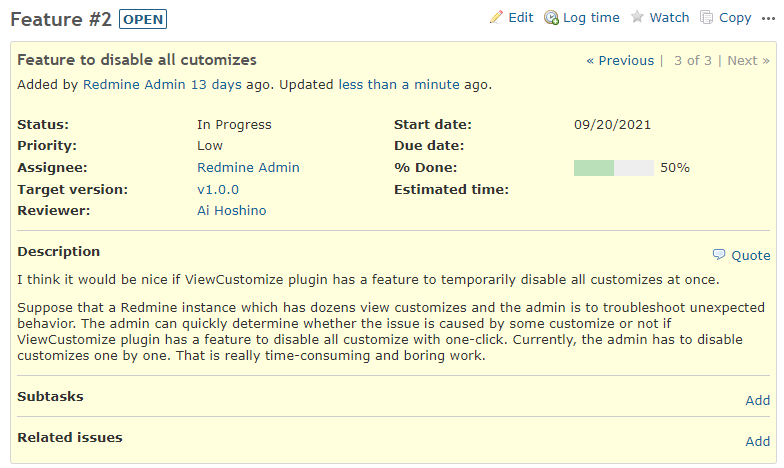
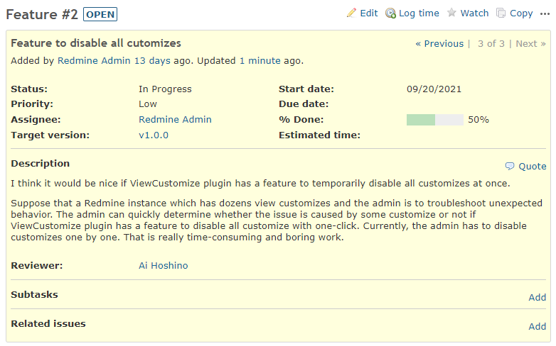

# Move custom field to after description

Move custom field to after description.  
カスタムフィールドを説明の後ろに移動します。

## Setting

### Path Pattern

None

### Insert Position

Bottom of issue detail
<!-- 
Head of all pages
Bottom of issue form
Bottom of issue detail
Bottom of all pages
-->

### Code

JavaScript
<!--
JavaScript
CSS
HTML
-->

```javascript
$(function() {
  // Note: Change the ID according to the custom field you want to target.
  const customField = $('.cf_1.attribute');

  const secondAttributes = $('<div class="attributes">').append(
    $('<div class="splitcontent">').append(
      $('<div class="splitcontentleft">').append(
        customField)));

  const description = $('.description');

  if (description.size() == 1) {
    $('.description').after(secondAttributes);
  } else {
    $('.attributes').after(secondAttributes);
  }
});
```

## Result

### Before



### After


