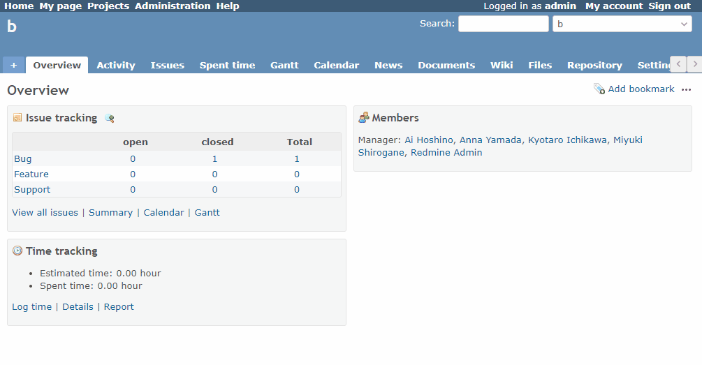

# Change the default branch on the Repository tab

Change the default branch on the Repository tab.  
リポジトリタブのデフォルトブランチを変更します。

## Setting

### Path Pattern

None

### Insert Position

Head of all pages
<!-- 
Head of all pages
Bottom of issue form
Bottom of issue detail
Bottom of all pages
-->

### Code

JavaScript
<!--
JavaScript
CSS
HTML
-->

```javascript
$(function() {
  // Note: Specify the branch name you want to default to.
  const branchName = '3.3-stable';
  const repositoryTabLink = $('#main-menu a.repository');
  
  repositoryTabLink.attr('href', repositoryTabLink.attr('href') + '?rev=' + encodeURIComponent(branchName));
});
```

## Result


