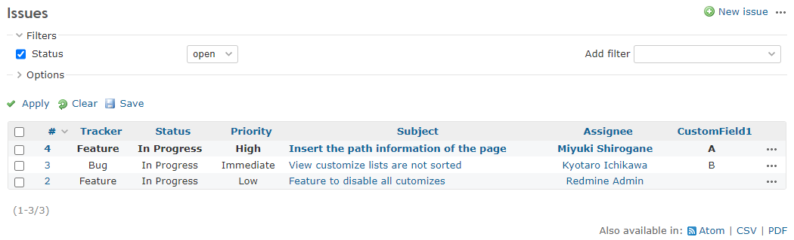

# Change the font of the ticket list according to the value of the custom field

Change the font of the ticket list according to the value of the custom field.  
カスタムフィールドの値に応じて、チケットリストのフォントを変更します。

In this example, if the value of custom field Id 1 is `A`, the font is set to bold.  
この例では、カスタムフィールドID:1 の値が`A`の場合、フォントを太字に変更します。

## Setting

### Path Pattern

`/issues$`

### Insert Position

Head of all pages
<!-- 
Head of all pages
Bottom of issue form
Bottom of issue detail
Bottom of all pages
-->

### Code

JavaScript
<!--
JavaScript
CSS
HTML
-->

```javascript
$(function() {
  $('table.issues td.cf_1')
    .filter(function() {
      return $(this).text() == 'A';
    })
    .parent()
    .css({
      'font-weight': 'bold'
    });
});
```

## Result


