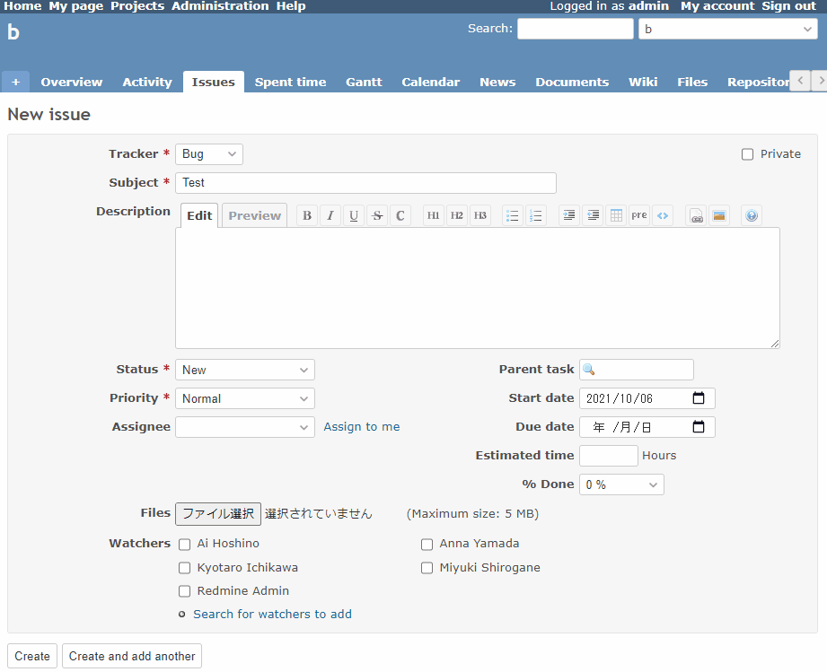

# Add an accesskey to the submit button of the issue

Add an accesskey to the submit button of the issue.  
チケットの送信ボタンにアクセスキーを追加します。

By setting the accesskey, you can press the submit button with the shortcut key.  
アクセスキーを設定することで、ショートカットキーで送信ボタンを押下できるようになります。

* [accesskey \- HTML: HyperText Markup Language \| MDN](https://developer.mozilla.org/en-US/docs/Web/HTML/Global_attributes/accesskey)

In this example, `s` is set as the accesskey.  
この例では、アクセスキーとして`s`を設定しています。

## Setting

### Path Pattern

None

### Insert Position

Bottom of issue form
<!-- 
Head of all pages
Bottom of issue form
Bottom of issue detail
Bottom of all pages
-->

### Code

JavaScript
<!--
JavaScript
CSS
HTML
-->

```javascript
$(function() {
  $('#issue-form input[name="commit"]').attr('accesskey', 's');
});
```

## Result


