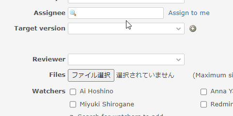

# Add a search function to the selectbox

Add a search function to the selectbox.  
セレクトボックスに検索機能を追加します。

In this example, the search function is added to the selectbox for the assignee.  
この例では、担当者のセレクトボックスに検索機能を追加しています。

## Setting

### Path Pattern

None

### Insert Position

Bottom of issue form
<!-- 
Head of all pages
Bottom of issue form
Bottom of issue detail
Bottom of all pages
-->

### Code

JavaScript
<!--
JavaScript
CSS
HTML
-->

```javascript
$(function() {

  const replaceSelectToAutocomplete = function(selectElement) {

    const $select = $(selectElement);
    if ($select.length == 0) {
      return;
    }

    const options = $select.find('option[value!=""]')
      .map(function() {
        const $option = $(this);
        return {
          label: $option.text(),
          optionValue: $option.val()
        };
      })
      .toArray();

    const $autocomplete = $('<input type="text" class="ui-autocomplete-input autocomplete" autocomplete="off">');

    const applyToAutocomplete = function() {
      const currentSelectValue = $select.val();
      if (currentSelectValue != '') {
        const initAutcompleteValue = $.grep(options, function(option) {
          return option.optionValue == currentSelectValue;
        })[0].label;

        $autocomplete.val(initAutcompleteValue);
      }
    }

    const applyToSelect = function() {
      const inputValue = $autocomplete.val();
      const matchOption = $.grep(options, function(option) {
        return option.label == inputValue;
      })[0];

      if (matchOption != null) {
        $select.val(matchOption.optionValue).change();
      } else {
        $autocomplete.val('');
        $select.val('').change();
      }
    }

    $autocomplete
      .autocomplete({
        source: options,
        minLength: 0,
        select: function(event, ui) {
          $select.val(ui.item.optionValue).change();
        }
      })
      .on('blur ', applyToSelect)
      .on('keypress', function(event) {
        if (event.key == 'Enter') {
          return false;
        } 
      });

    applyToAutocomplete();

    $select
      .on('change', applyToAutocomplete)
      .hide()
      .after($autocomplete);

    if (selectElement == '#issue_assigned_to_id') {
      // Replace 'Assign to me' so that it also reflects when click on it.
      $('.assign-to-me-link').on('click', function(event) {
        event.preventDefault();
        const element = $(event.target);
        $('#issue_assigned_to_id').val(element.data('id')).change();
        element.hide();
      });
    }
  }

  replaceSelectToAutocomplete('#issue_assigned_to_id');
});
```

## Note

This can be applied not only to the assignee, but also to a list of custom fields, etc.  
担当者だけでなく、リストのカスタムフィールドなどにも適用できます。

```javascript
replaceSelectToAutocomplete('#issue_custom_field_values_1');
```

## Result


