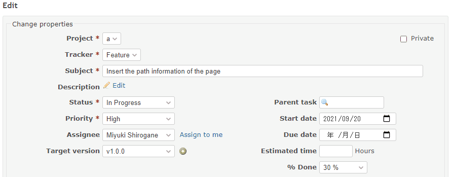

# Automatically sets each item at the close of the issue

Set the following items when the status is closed.  
ステータスを終了にした時、下記の項目を設定します。

* 100% done  
進捗率を100%に
* If due date is not entered, set it to today  
期日が未入力なら今日を設定

## Setting

### Path Pattern

None

### Insert Position

Bottom of issue form
<!-- 
Head of all pages
Bottom of issue form
Bottom of issue detail
Bottom of all pages
-->

### Code

JavaScript
<!--
JavaScript
CSS
HTML
-->

```javascript
$(function () {

  $('#issue_status_id').on('change', function() {

    if ($('#issue_status_id').val() == '5') { // 5: Closed
      
      if ($('#issue_due_date').val() == '') {
        const today = $.datepicker.formatDate('yy-mm-dd', new Date());
        $('#issue_due_date').val(today);
       }

      $('#issue_done_ratio').val('100');
    }
  });
});
```

## Result


