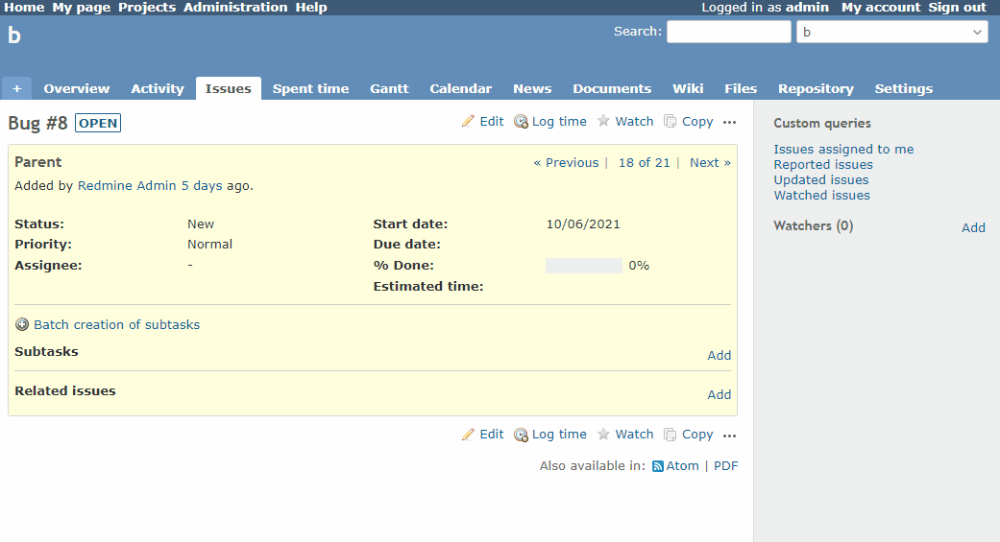

# Create a subtask using the REST API

Create a subtask using the REST API.  
REST APIを使って子チケットを作成します。

This example will allow you to create predetermined subtasks with a single button.  
この例では、あらかじめ定義した子チケットをボタン1つで作成できるようにします。

## Setting

### Path Pattern

None

### Insert Position

Bottom of issue detail
<!-- 
Head of all pages
Bottom of issue form
Bottom of issue detail
Bottom of all pages
-->

### Code

JavaScript
<!--
JavaScript
CSS
HTML
-->

```javascript
$(function() {

  var trackerId = $('#issue_tracker_id').val();
  var subject = $('#issue_subject').val();
  var priorityId = $('#issue_priority_id').val();
  var parentIssueId =  ViewCustomize.context.issue.id;

  // Defining subtasks 
  var issueChildren = [
    {
      'issue': {
        'tracker_id': trackerId,
        'subject': subject + ' - Subtask1',
        'priority_id': priorityId,
        'parent_issue_id': parentIssueId
      }
    },
    {
      'issue': {
        'tracker_id': trackerId,
        'subject': subject + ' - Subtask2',
        'priority_id': priorityId,
        'parent_issue_id': parentIssueId
      }
    },
    {
      'issue': {
        'tracker_id': trackerId,
        'subject': subject + ' - Subtask3',
        'priority_id': priorityId,
        'parent_issue_id': parentIssueId
      }
    }
  ];

  var link = $('<a title="Batch creation of subtasks" class="icon icon-add" href="#">Batch creation of subtasks</a>');
  $('#issue_tree').before($('<p>').append(link));

  link.on('click', function() {

    if (!confirm('Create a batch of subtasks. Are you sure?')) {
      return;
    }

    // Execute the subtask creation process (asynchronous) sequentially and reload at the end.
    var defer = $.Deferred();
    var promise = defer.promise();

    for (var i = 0; i < issueChildren.length; i++) {
      promise = promise.then(createIssue(issueChildren[i]));
    }

    promise
      .done(function() {
        location.reload();
      })
      .fail(function() {
        alert('Failed');
      });

    defer.resolve();
  });

  function createIssue(issue) {

    return function() {

      return $.ajax({
        type: 'POST',
        url: '/projects/' + ViewCustomize.context.project.identifier + '/issues.json',
        headers: {
          'X-Redmine-API-Key': ViewCustomize.context.user.apiKey
        },
        contentType: 'application/json',
        data: JSON.stringify(issue)
      });

    };
  }
})
```

## Result



## Note

In this example, we will use REST API, so we need to "Enable REST web service" via REST in Redmine settings.  
この例ではREST APIを利用するので、Redmineの設定で"RESTによるWebサービス"を有効にしておく必要があります。

Also, an API key must have been created. For details on creating an API key, please refer to the following.  
また、APIキーが払い出されている必要もあります。APIキーの払い出しについては、下記を参考にしてください。

* https://github.com/onozaty/redmine-view-customize#api-access-key

