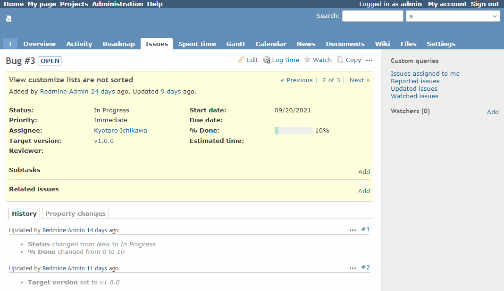

# When creating a child issue, the information from the parent issue is used

When creating a child issue, the information from the parent issue is used.  
子チケット作成時に親チケットの情報を利用します。

In this example, the subject, priority, and target version are taken over.  
この例では、題名、優先度、対象バージョンを引き継ぎます。

## Setting

### Path Pattern

None

### Insert Position

Bottom of issue detail
<!-- 
Head of all pages
Bottom of issue form
Bottom of issue detail
Bottom of all pages
-->

### Code

JavaScript
<!--
JavaScript
CSS
HTML
-->

```javascript
$(function() {

  const useFieldIds = [
    'issue_subject',
    'issue_priority_id',
    'issue_fixed_version_id'
  ];

  const addLink = $('#issue_tree a[href*="/issues/new"]')[0];
  if (!addLink) {
    return;
  }

  for (let i = 0; i < useFieldIds.length; i++) {
    const field = $('#' + useFieldIds[i]);
    if (field.val() != null) {
      addLink.href += '&' + encodeURIComponent(field.attr('name'))  + '=' + encodeURIComponent(field.val());
    }
  }
})
```

## Result



