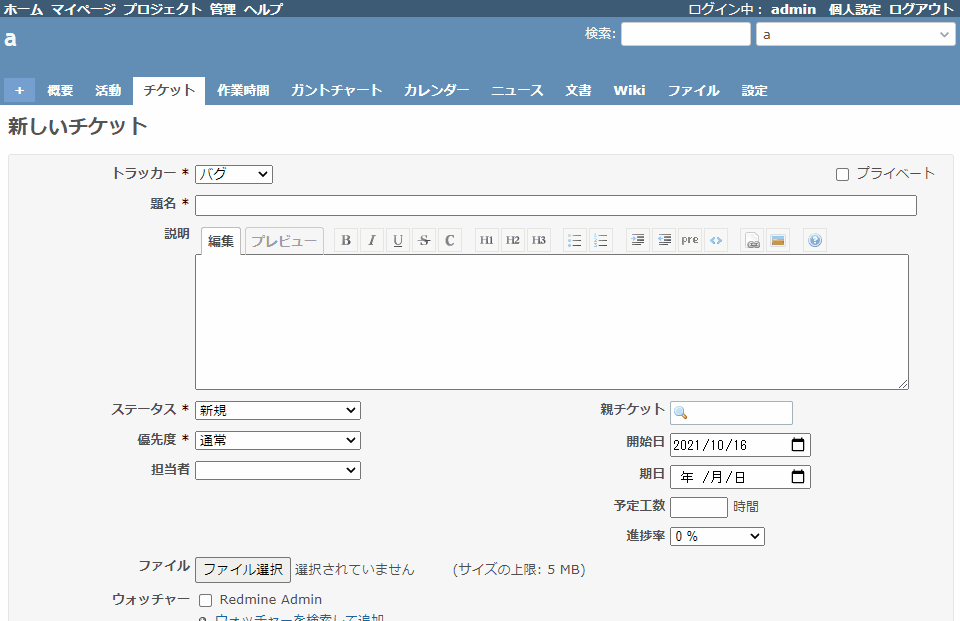

# Paste image from clipboard

Paste image from clipboard.  
クリップボードから画像を張り付けられるようにします。

This is the same functionality that is implemented as standard in Redmine 4.1.  
Redmine 4.1 で標準として実装されている機能と同じものになります。

* https://www.redmine.org/issues/3816

## Setting

### Path Pattern

None

### Insert Position

Head of all pages
<!-- 
Head of all pages
Bottom of issue form
Bottom of issue detail
Bottom of all pages
-->

### Code

JavaScript
<!--
JavaScript
CSS
HTML
-->

```javascript
$(function() {

  $('form div.box').has('input:file.filedrop').on('paste', copyImageFromClipboard);

  function copyImageFromClipboard(e) {
    if (!$(e.target).hasClass('wiki-edit')) { return; }
    var clipboardData = e.clipboardData || e.originalEvent.clipboardData
    if (!clipboardData) { return; }
    var items = clipboardData.items
    for (var i = 0 ; i < items.length ; i++) {
      var item = items[i];
      if (item.type.indexOf("image") != -1) {
        var blob = item.getAsFile();
        var date = new Date();
        var filename = 'clipboard-'
          + date.getFullYear()
          + ('0'+(date.getMonth()+1)).slice(-2)
          + ('0'+date.getDate()).slice(-2)
          + ('0'+date.getHours()).slice(-2)
          + ('0'+date.getMinutes()).slice(-2)
          + '-' + randomKey(5).toLocaleLowerCase()
          + '.' + blob.name.split('.').pop();
        var file = new File([blob], filename, {type: blob.type});
        var inputEl = $('input:file.filedrop').first()
        handleFileDropEvent.target = e.target;
        addFile(inputEl, file, true);
      }
    }
  }
})
```

## Result



