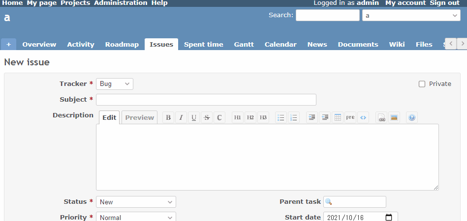

# Inline auto complete in textarea

Inline autocomplete in textarea.  
テキストエリアで入力補完を行います。

In this example, the following will be auto completed.  
この例では、下記を自動補完します。

* `{{`
  * `{{collapse(View details...)}}`
  * `{{thumbnail(image.png)}}`
* `<pre`
  * `<pre><code class="java"></code></pre>`
  * `<pre><code class="sql"></code></pre>`

## Setting

### Path Pattern

None

### Insert Position

Head of all pages
<!-- 
Head of all pages
Bottom of issue form
Bottom of issue detail
Bottom of all pages
-->

### Code

HTML
<!--
JavaScript
CSS
HTML
-->

```html
<script src="https://cdnjs.cloudflare.com/ajax/libs/at.js/1.5.2/js/jquery.atwho.min.js" defer></script>
<script src="https://cdnjs.cloudflare.com/ajax/libs/Caret.js/0.3.1/jquery.caret.min.js" defer></script>
<style>
.atwho-view {
    position:absolute;
    top: 0;
    left: 0;
    display: none;
    margin-top: 18px;
    background: white;
    color: black;
    border: 1px solid #DDD;
    border-radius: 3px;
    box-shadow: 0 0 5px rgba(0,0,0,0.1);
    min-width: 120px;
    z-index: 11110 !important;
}

.atwho-view .atwho-header {
    padding: 5px;
    margin: 5px;
    cursor: pointer;
    border-bottom: solid 1px #eaeff1;
    color: #6f8092;
    font-size: 11px;
    font-weight: bold;
}

.atwho-view .atwho-header .small {
    color: #6f8092;
    float: right;
    padding-top: 2px;
    margin-right: -5px;
    font-size: 12px;
    font-weight: normal;
}

.atwho-view .atwho-header:hover {
    cursor: default;
}

.atwho-view .cur {
    background: #3366FF;
    color: white;
}
.atwho-view .cur small {
    color: white;
}
.atwho-view strong {
    color: #3366FF;
}
.atwho-view .cur strong {
    color: white;
    font:bold;
}
.atwho-view ul {
    /* width: 100px; */
    list-style:none;
    padding:0;
    margin:auto;
    max-height: 200px;
    overflow-y: auto;
}
.atwho-view ul li {
    display: block;
    padding: 5px 10px;
    border-bottom: 1px solid #DDD;
    cursor: pointer;
    /* border-top: 1px solid #C8C8C8; */
}
.atwho-view small {
    font-size: smaller;
    color: #777;
    font-weight: normal;
}
</style>
<script>
$(document).on('focus', 'textarea.wiki-edit', function(event) {

  const element = event.target;

  $(element)
    .atwho({
      at: '<pre',
      data: [
        {name: 'java', content: '<pre><code class="java">\n</code></pre>'},
        {name: 'sql', content: '<pre><code class="sql">\n</code></pre>'}],
      insertTpl: '${content}',
      suffix: ''
    })
    .atwho({
      at: '{{',
      data: [
        {name: 'collapse', content: '{{collapse(View details...)\n}}'},
        {name: 'thumbnail', content: '{{thumbnail(image.png)}}'}],
      insertTpl: '${content}',
      suffix: ''
    });
});
</script>
```

## Result



