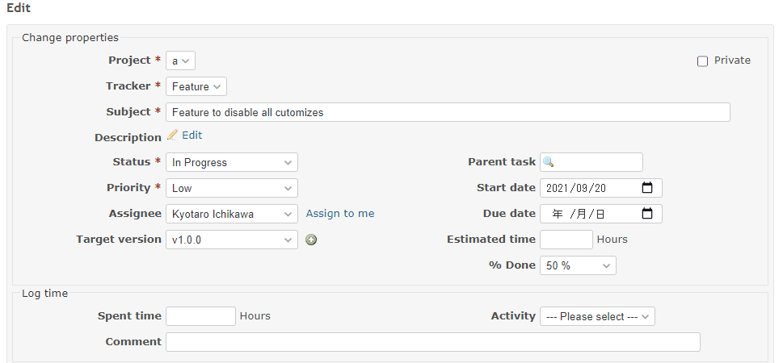

# Force the assignee to change when the project is changed

Force the assignee to change when the project is changed.  
プロジェクトを変更したら、担当者を強制的に変更します。

## Setting

### Path Pattern

None

### Insert Position

Bottom of issue form
<!-- 
Head of all pages
Bottom of issue form
Bottom of issue detail
Bottom of all pages
-->

### Code

JavaScript
<!--
JavaScript
CSS
HTML
-->

```javascript
$(function() {

  $('#issue_project_id').on('change', function() {

    switch($('#issue_project_id').val()) {
      case '1':
        $('#issue_assigned_to_id').val('6');
        break;

      case '2':
        $('#issue_assigned_to_id').val('7');
        break;

      case '3':
        $('#issue_assigned_to_id').val('8');
        break;
    }
  });
});
```

## Result



