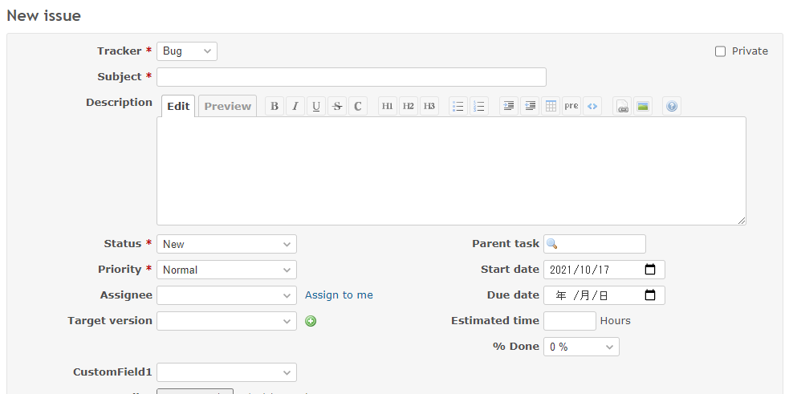

# Move custom field to after the tracker

Move custom field to after the tracker.  
カスタムフィールドをトラッカーの後に移動します。

## Setting

### Path Pattern

None

### Insert Position

Bottom of issue form
<!-- 
Head of all pages
Bottom of issue form
Bottom of issue detail
Bottom of all pages
-->

### Code

JavaScript
<!--
JavaScript
CSS
HTML
-->

```javascript
$(function() {

  // Note: Change the ID according to the custom field you want to target.
  const customField = $('p:has(#issue_custom_field_values_1)');

  $('p:has(#issue_tracker_id)')
    .after(
      $('<div class="splitcontent">')
        .append(
          $('<div class="splitcontentleft">').append(customField)));
});
```

## Result

### Before



### After


