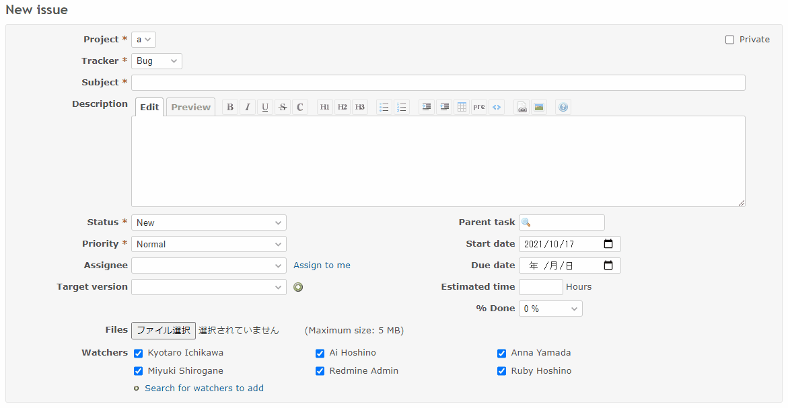

# When the project is changed, the watcher is also changed

When the project is changed, the watcher is also changed.  
プロジェクトを変更した時に、ウォッチャーを変更します。

## Setting

### Path Pattern

`/issues/`

### Insert Position

Head of all pages
<!-- 
Head of all pages
Bottom of issue form
Bottom of issue detail
Bottom of all pages
-->

### Code

JavaScript
<!--
JavaScript
CSS
HTML
-->

```javascript
$(function() {

  const checkWatcher = function(userId) {
    if ($('#issue_watcher_user_ids_' + userId).length == 0) {
      // When the number of users exceeds 20, the check box is not initially displayed, so add a check box.
      const label = $('<label>').attr({
        id: 'issue_watcher_user_ids_' + userId,
        class: 'floating'
      }).append(
        $('<input>').attr({
          type: 'checkbox',
          name: 'issue[watcher_user_ids][]',
          value: userId
        })
      );

      $('#watchers_inputs').append(label);
    }
    
    $('#issue_watcher_user_ids_' + userId + ' input').prop('checked', true);
  }

  const changeWatcher = function() {

    // reset all watchers
    $('input[name="issue[watcher_user_ids][]"]').prop('checked', false);

    switch($('#issue_project_id').val()) {
      case '1':
        checkWatcher(1);
        break;

      case '2':
        checkWatcher(5);
        break;

      case '3':
        checkWatcher(6);
        break;
    }
  };

  const allAttributes = document.getElementById('all_attributes');
  if (!allAttributes) {
    return;
  }

  allAttributes.addEventListener(
    'change',
    function(e) {
      if (e.target.id == 'issue_project_id') {
        changeWatcher();
      }
    },
    // Capturing phase (To work before updateIssueFrom is executed)
    true);
});
```

## Result



## Note

* [プロジェクト切り替え時にウォッチャーを変更する\(Redmine View Customize Plugin\) \- Enjoy\*Study](https://blog.enjoyxstudy.com/entry/2019/12/08/000000)
