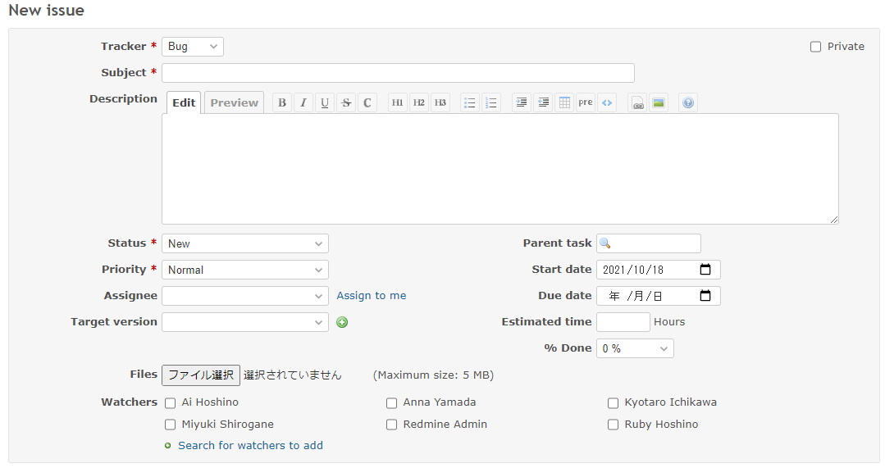
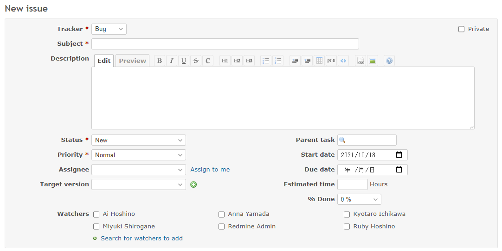

# Hide file attachments in a specific project

Hide file attachments in a specific project.  
特定のプロジェクトでファイル添付を非表示にします。

In this example, we will hide file attachments in the project with the project identifier `a`.  
この例では、プロジェクト識別子が"a"のプロジェクトで非表示にします。

## Setting

### Path Pattern

None

### Insert Position

Head of all pages
<!-- 
Head of all pages
Bottom of issue form
Bottom of issue detail
Bottom of all pages
-->

### Code

CSS
<!--
JavaScript
CSS
HTML
-->

```css
.project-a #issue-form #attachments_form, .project-a #issue-form .attachments_form {
  display: none;
}
```

## Result

### Before



### After


