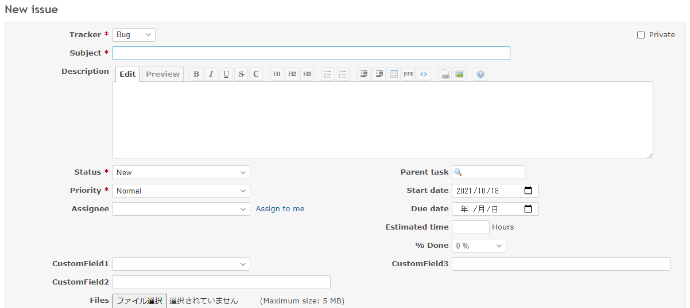
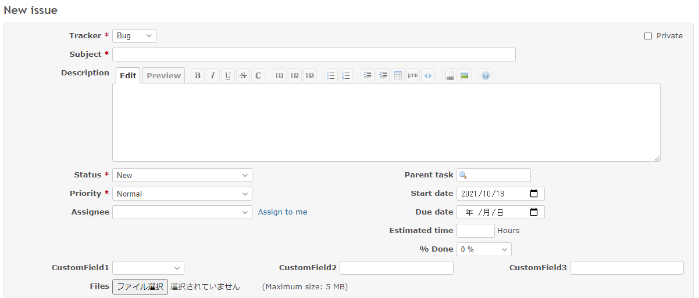

# Displays the custom fields in three columns

Displays the custom fields in three columns.  
カスタムフィールドを3列で表示します。

## Setting

### Path Pattern

None

### Insert Position

Bottom of issue form
<!-- 
Head of all pages
Bottom of issue form
Bottom of issue detail
Bottom of all pages
-->

### Code

JavaScript
<!--
JavaScript
CSS
HTML
-->

```javascript
$(function() {

  // Note: Change the ID according to the custom field you want to target
  const field1 = $('#issue_custom_field_values_1');
  const field2 = $('#issue_custom_field_values_2');
  const field3 = $('#issue_custom_field_values_3');

  // Change layout
  const content = $('<div class="splitcontent">')
    .append($('<div class="splitcontentleft">').append(field1.parent()))
    .append($('<div class="splitcontentleft">').append(field2.parent()))
    .append($('<div class="splitcontentright">').append(field3.parent()));

  $('#attributes').append(content);
})
```

## Result

### Before



### After


