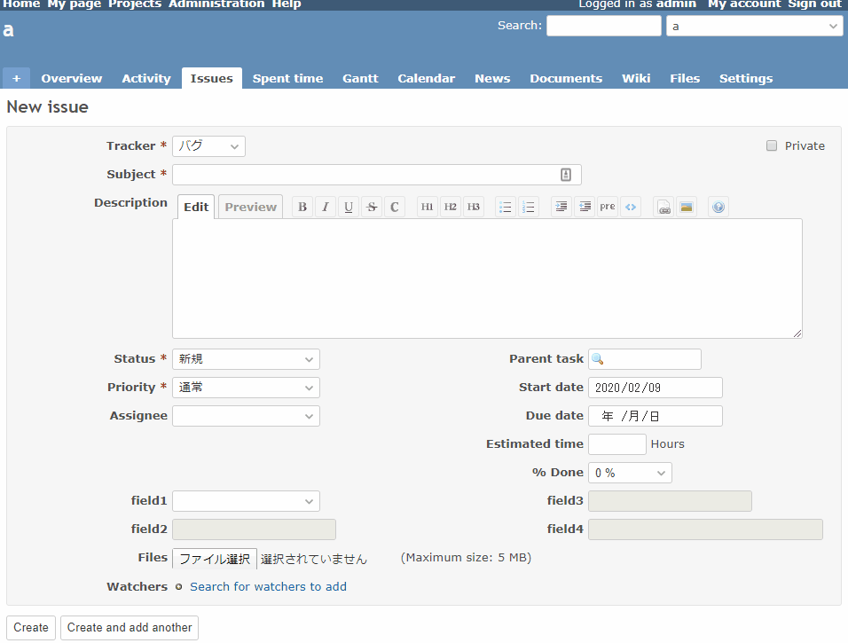

# When the parent custom field is selected, the child custom fields will be enabled

When the parent custom field is selected, the child custom fields will be enabled.    
親のカスタムフィールドが選択されたら、子のカスタムフィールドも入力可能にします。

## Setting

### Path Pattern

None

### Insert Position

Bottom of issue form
<!-- 
Head of all pages
Bottom of issue form
Bottom of issue detail
Bottom of all pages
-->

### Code

JavaScript
<!--
JavaScript
CSS
HTML
-->

```javascript
$(function() {

  // Note: Change the ID according to the custom field you want to target
  const parentField = $('#issue_custom_field_values_1');
  const childFields = [
    $('#issue_custom_field_values_2'),
    $('#issue_custom_field_values_3'),
    $('#issue_custom_field_values_4')
  ];

  const changeEnable = function() {

    if (parentField.val() != '') {
      childFields.forEach(function(child) {
        child.prop('disabled', false);
      });
    } else {
      childFields.forEach(function(child) {
        child.prop('disabled', true);
      });
    }
  }

  parentField.change(changeEnable);

  changeEnable();
})
```

## Result


