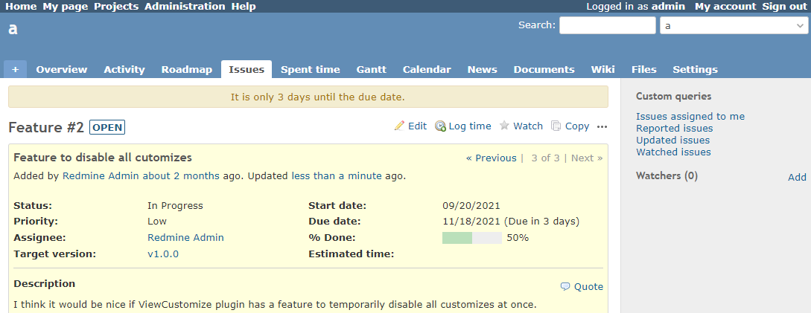

# Display a warning three days before the due date

The issue details screen will display a warning three days before the due date.  
チケット詳細画面で期日の3日前になったら警告を表示します。

## Setting

### Path Pattern

None

### Insert Position

Bottom of issue detail
<!-- 
Head of all pages
Bottom of issue form
Bottom of issue detail
Bottom of all pages
-->

### Code

JavaScript
<!--
JavaScript
CSS
HTML
-->

```javascript
$(function() {

  const daysLeft = 3;

  const dueDateArray = $('#issue_due_date').val().split('-');
  const alertDate = new Date(dueDateArray[0], dueDateArray[1] - 1, dueDateArray[2] - daysLeft);

  const now = new Date();
  const nowDate = new Date(now.getFullYear(), now.getMonth(), now.getDate());

  if (nowDate >= alertDate) {
    $('#content').prepend('<div class="warning">It is only ' + daysLeft + ' days until the due date.</div>');
  }
});
```

## Result


