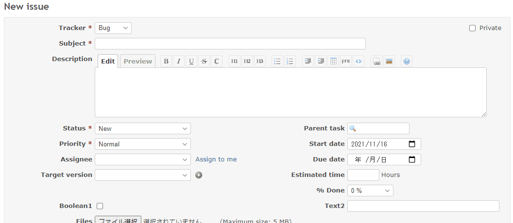

# Disable text if checked

When the checkbox is checked, disable the text.  
チェックボックスがチェックされたら、テキストを無効化します。

## Setting

### Path Pattern

None

### Insert Position

Bottom of issue form
<!-- 
Head of all pages
Bottom of issue form
Bottom of issue detail
Bottom of all pages
-->

### Code

JavaScript
<!--
JavaScript
CSS
HTML
-->

```javascript
$(function() {

  const checkbox = $('#issue_custom_field_values_1');
  const text = $('#issue_custom_field_values_2');

  function changeEnableText() {
    text.prop('disabled', checkbox.prop('checked'));
  }

  checkbox.on('change', changeEnableText);

  changeEnableText();
});
```

## Result


