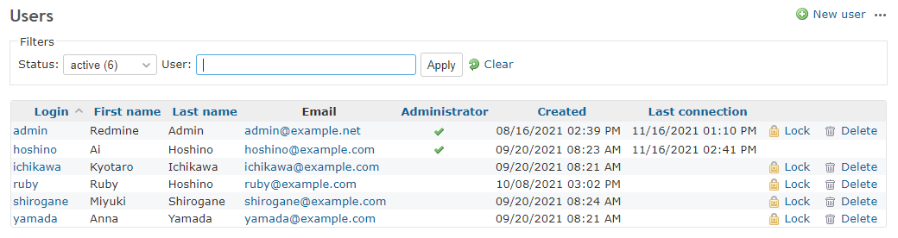
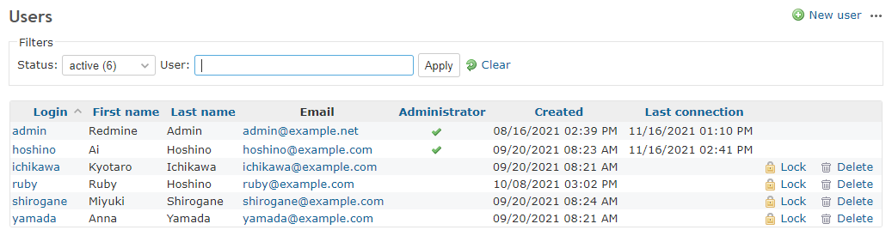

# Hide the delete and lock buttons for specific user

Hide the delete and lock buttons for specific user.  
特定ユーザの削除、ロックボタンを非表示にします。

In this example, the button is hidden so that user ID 1 cannot be deleted or locked.  
この例では、ユーザID:1のユーザを削除もロックも出来ないようにボタンを非表示にしています。

## Setting

### Path Pattern

None

### Insert Position

Head of all pages
<!-- 
Head of all pages
Bottom of issue form
Bottom of issue detail
Bottom of all pages
-->

### Code

CSS
<!--
JavaScript
CSS
HTML
-->

```css
a[data-method="put"][href="/users/1?user%5Bstatus%5D=3"],
a[data-method="delete"][href^="/users/1?"] {
  display: none;
}
```

## Result

### Before



### After


