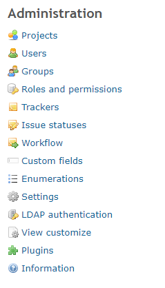
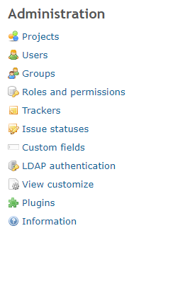

# Hide some administrator menus for specific user

Hide some administrator menus for specific user.  
特定ユーザに対して一部管理者メニューを非表示にします。

In this example, three items are hidden for the user with user ID:8 Workflow, Enumerations, and Settings.  
この例では、ユーザID:8のユーザに対して、ワークフロー、選択肢の値、設定の3つを非表示にしています。

## Setting

### Path Pattern

None

### Insert Position

Head of all pages
<!-- 
Head of all pages
Bottom of issue form
Bottom of issue detail
Bottom of all pages
-->

### Code

JavaScript
<!--
JavaScript
CSS
HTML
-->

```javascript
$(function() {

  // for user_id = 8 
  if (ViewCustomize.context.user.id == 8) {

    $('li:has(a[href="/workflows/edit"])').hide();  // Workflow
    $('li:has(a[href="/enumerations"])').hide();    // Enumerations
    $('li:has(a[href="/settings"])').hide();        // Settings
  }
});
```

## Result

### Before



### After


