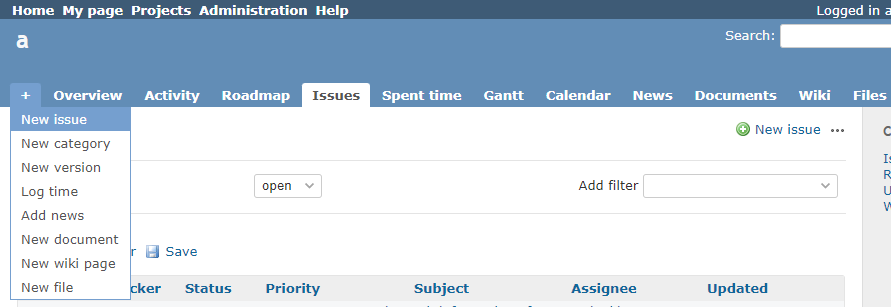
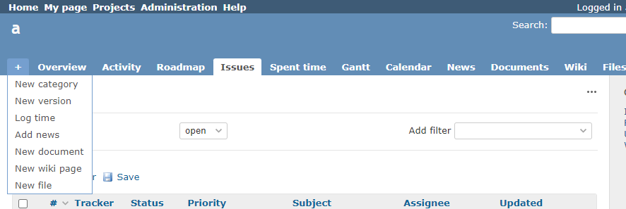

# Hide the new issue link after a specific date

Hide the new issue link after a specific date. 
指定の日以降は新規チケットのリンクを非表示にします。

## Setting

### Path Pattern

None

### Insert Position

Head of all pages
<!-- 
Head of all pages
Bottom of issue form
Bottom of issue detail
Bottom of all pages
-->

### Code

JavaScript
<!--
JavaScript
CSS
HTML
-->

```javascript
$(function() {

  const baseDate = new Date('2021-11-18 00:00:00');

  if (new Date() >= baseDate) {

    $("a.new-issue").hide();
    $('.menu-children a.new-issue-sub').parent().hide();
  }
});
```

## Result

### Before



### After


