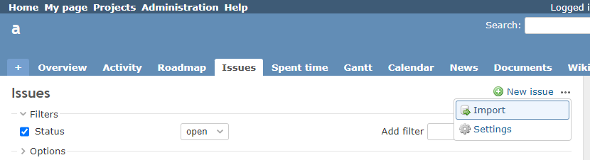

# Hide Summary link in issue list

Hide Summary link in issue list.  
チケット一覧のサマリーリンクを表示にします。

## Setting

### Path Pattern

None

### Insert Position

Head of all pages
<!-- 
Head of all pages
Bottom of issue form
Bottom of issue detail
Bottom of all pages
-->

### Code

CSS
<!--
JavaScript
CSS
HTML
-->

```css
a[href$="/issues/report"] {
  display: none;
}
```

## Result

### Before


### After


