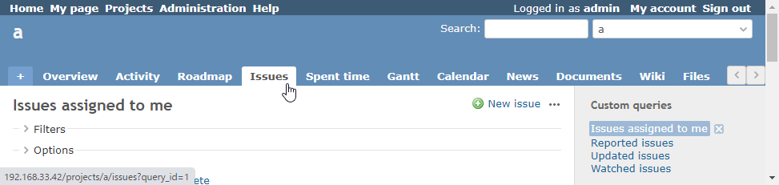

# Change the default query in the Issues tab

Change the default query in the Issues tab.  
チケットタブでのデフォルトクエリを変更します。

## Setting

### Path Pattern

None

### Insert Position

Head of all pages
<!-- 
Head of all pages
Bottom of issue form
Bottom of issue detail
Bottom of all pages
-->

### Code

JavaScript
<!--
JavaScript
CSS
HTML
-->

```javascript
$(function() {

  const issueMenuLink = $('#main-menu a[href$="/issues"]');
  // Note: Change the query ID accordingly.
  issueMenuLink.attr('href', issueMenuLink.attr('href') + '?query_id=1');
});
```

## Result


