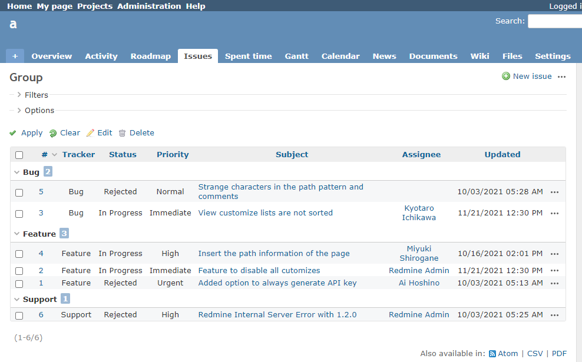
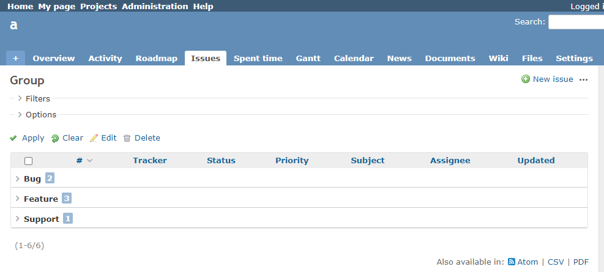

# Displays the issue list in a collapsed state

Displays the issue list in a collapsed state.  
チケット一覧を折りたたんだ状態で表示します。

## Setting

### Path Pattern

`/issues$`

### Insert Position

Head of all pages
<!-- 
Head of all pages
Bottom of issue form
Bottom of issue detail
Bottom of all pages
-->

### Code

JavaScript
<!--
JavaScript
CSS
HTML
-->

```javascript
$(function() {
  $('.toggle-all').first().click();
});
```

## Result

### Before



### After


