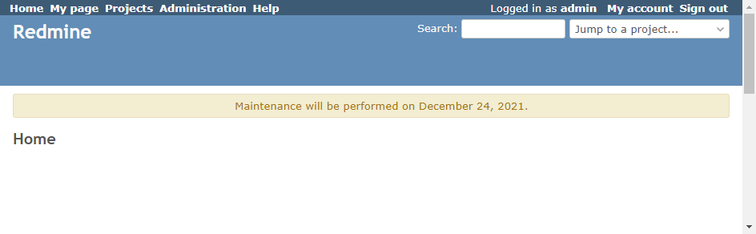

# Show banner

Show banner.  
バナーを表示します。

## Setting

### Path Pattern

None

### Insert Position

Head of all pages
<!-- 
Head of all pages
Bottom of issue form
Bottom of issue detail
Bottom of all pages
-->

### Code

JavaScript
<!--
JavaScript
CSS
HTML
-->

```javascript
$(function() {
  $('#content').prepend('<div class="warning">Maintenance will be performed on December 24, 2021.</div>');
});
```

## Result




## Note

