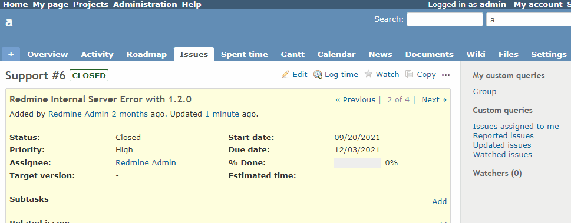

# Clear due date when status is changed from closed

Clear due date when changing the status from closed to other status.  
ステータスを終了から他のステータスを変更した際に期日をクリアします。

## Setting

### Path Pattern

None

### Insert Position

Bottom of issue form
<!-- 
Head of all pages
Bottom of issue form
Bottom of issue detail
Bottom of all pages
-->

### Code

JavaScript
<!--
JavaScript
CSS
HTML
-->

```javascript
$(function() {

  let prevIssueStatusId = $('#issue_status_id').val();

  $('#issue_status_id').on('change', function() {
    if (prevIssueStatusId == '5') {
      $('#issue_due_date').val('');
    }

    prevIssueStatusId = $('#issue_status_id').val();
  });
});
```

## Result


