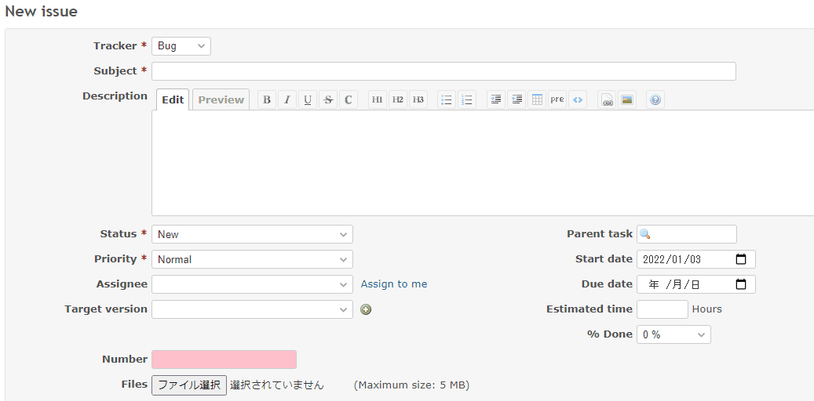

# Change the style according to the input value of the custom field

Change the style according to the input value of the custom field.  
カスタムフィールドの入力値に応じてスタイルを変更します。

In this example, if it is blank or 0, the background color will be changed to pink.  
この例では、値が空白または0の場合、背景色をピンクに変更します。

## Setting

### Path Pattern

None

### Insert Position

Bottom of issue form
<!-- 
Head of all pages
Bottom of issue form
Bottom of issue detail
Bottom of all pages
-->

### Code

JavaScript
<!--
JavaScript
CSS
HTML
-->

```javascript
$(function() {

  const setup = function(fieldSelector) {

    const field = $(fieldSelector);

    const applyStyle = function() {

      // If blank or 0, the background color will be pink
      if (field.val() == '' || field.val() == '0') {
        field.css({'background-color': 'pink'});
      } else {
        field.css({'background-color': ''});
      }
    };

    field.on('change', applyStyle);

    applyStyle();
  }

  // Note: Change the ID according to the custom field you want to target.
  setup('#issue_custom_field_values_1');

});
```

## Result


