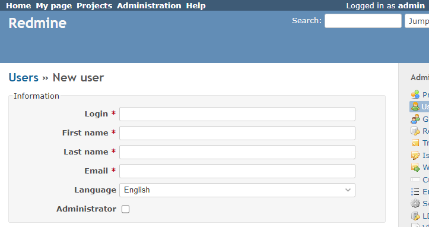
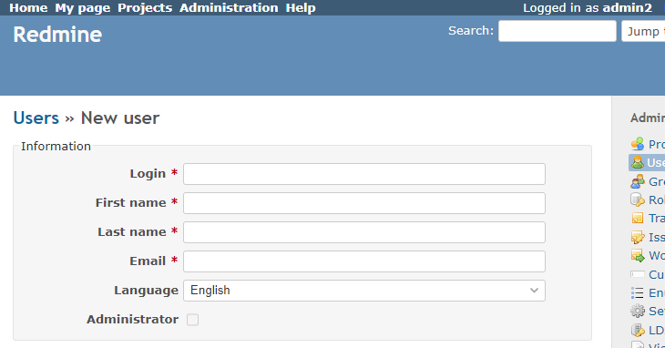

# Allow only some users to create Administrators

Allow only some users to create Administrators.  
一部のユーザでしか管理者を作成できないようにします。


In this example, only user ID:1 will be allowed to create administrators.  
この例では、ユーザID:1のユーザに対しのみ、管理者の作成を許可します。

## Setting

### Path Pattern

None

### Insert Position

Head of all pages
<!-- 
Head of all pages
Bottom of issue form
Bottom of issue detail
Bottom of all pages
-->

### Code

JavaScript
<!--
JavaScript
CSS
HTML
-->

```javascript
$(function() {
  if (ViewCustomize.context.user.id != 1) {
    $('#user_admin').prop('disabled', true);
  }
});
```

## Result

for user ID = 1



for user ID != 1


