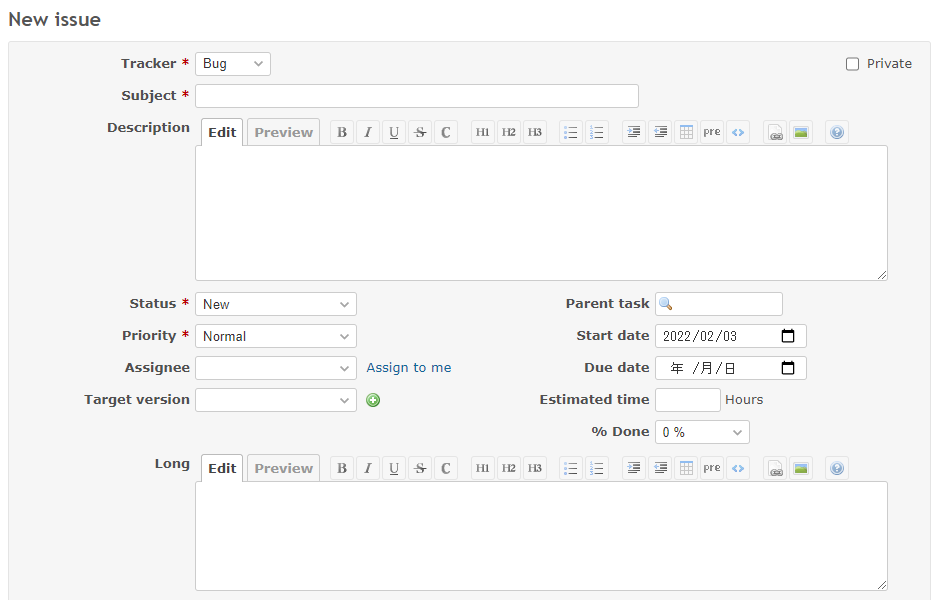
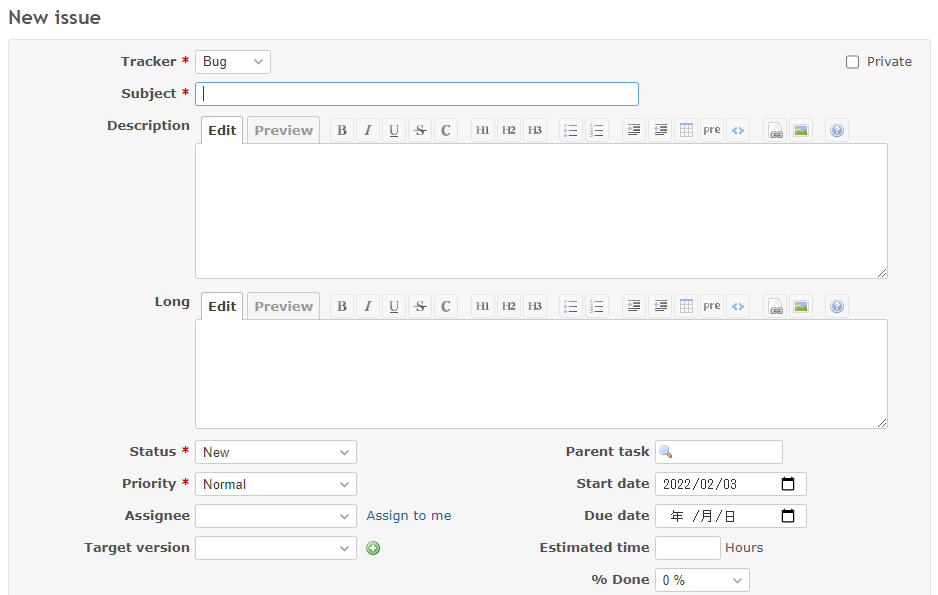

# Move the long text custom field to after the description

Move the long text custom field to after the description.  
長いテキストのカスタムフィールドをトラッカーの後に移動します。

## Setting

### Path Pattern

None

### Insert Position

Bottom of issue form
<!-- 
Head of all pages
Bottom of issue form
Bottom of issue detail
Bottom of all pages
-->

### Code

JavaScript
<!--
JavaScript
CSS
HTML
-->

```javascript
$(function() {

  // Note: Change the ID according to the custom field you want to target.
  const customField = $('p:has(label[for="issue_custom_field_values_1"])');

  $('p:has(label[for="issue_description"])')
    .after(customField);
});
```

## Result

### Before



### After



