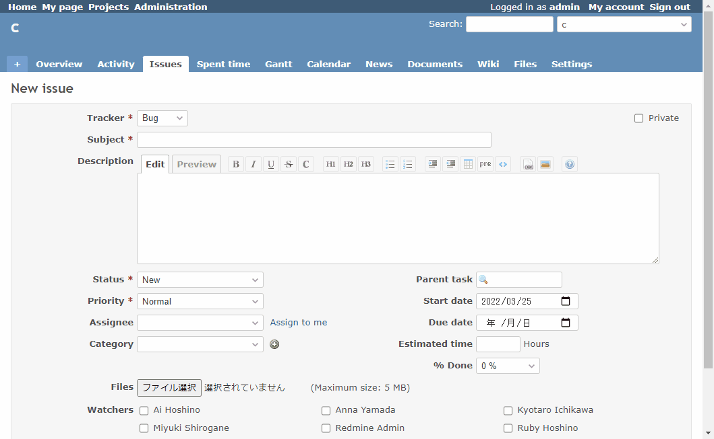

# Narrow down categories according to the tracker

Narrow down categories according to the tracker.  
トラッカーに応じてカテゴリを絞り込みます。

## Setting

### Path Pattern

None

### Insert Position

Bottom of issue form
<!-- 
Head of all pages
Bottom of issue form
Bottom of issue detail
Bottom of all pages
-->

### Code

JavaScript
<!--
JavaScript
CSS
HTML
-->

```javascript
$(function() {

  // In IE, option is not hidden by "display:none", so "disabled" it to make it unselectable.
  const hideOption = function(option) {
    option.hide();
    option.attr("selected", false);
    option.prop('disabled', true);
  }
  const showOption = function(option) {
    option.show();
    option.prop('disabled', false);
  }

  // If set "Insert Position" is "Bottom of issue form",
  // it will be executed every time the tracker is changed,
  // so there is no need to execute it on the onchange event.
  switch($('#issue_tracker_id').val()) {
    case '1':
      showOption($('#issue_category_id > option[value="1"]'));
      showOption($('#issue_category_id > option[value="2"]'));
      hideOption($('#issue_category_id > option[value="3"]'));
      hideOption($('#issue_category_id > option[value="4"]'));
      break;

    case '2':
      hideOption($('#issue_category_id > option[value="1"]'));
      hideOption($('#issue_category_id > option[value="2"]'));
      showOption($('#issue_category_id > option[value="3"]'));
      showOption($('#issue_category_id > option[value="4"]'));
      break;

    default:
      showOption($('#issue_category_id > option[value="1"]'));
      showOption($('#issue_category_id > option[value="2"]'));
      showOption($('#issue_category_id > option[value="3"]'));
      showOption($('#issue_category_id > option[value="4"]'));
      break;
  }

});
```

## Result


