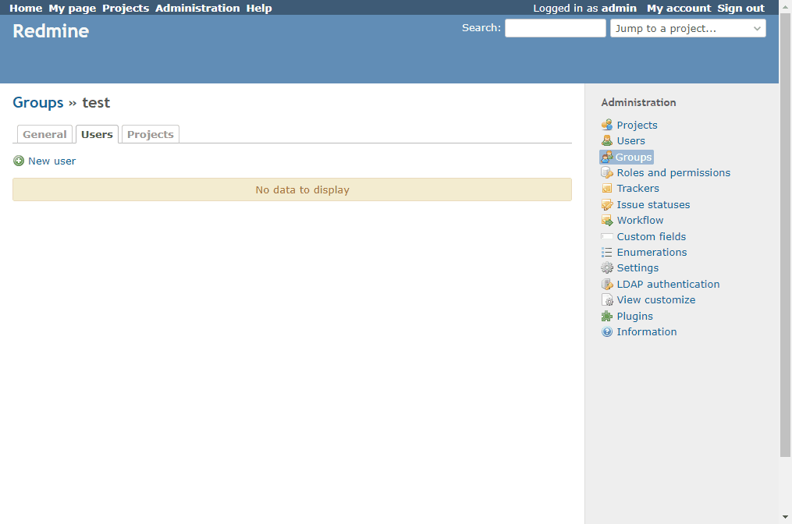

# Add a check all link to the add user to group dialog

Add a check all link to the add user to group dialog.  
グループにユーザを追加するダイアログに、すべてをチェックするリンクを追加します。

## Setting

### Path Pattern

`/groups/[0-9]+/edit`

### Insert Position

Head of all pages
<!-- 
Head of all pages
Bottom of issue form
Bottom of issue detail
Bottom of all pages
-->

### Code

JavaScript
<!--
JavaScript
CSS
HTML
-->

```javascript
$(function() {
  $('#ajax-modal').on('dialogopen', function() {

    if ($(this).find('#users').size() == 0) {
      return;
    }

    const checkAllLink = $('<a id="checkAllLink" href="#">Check All</a>');
    checkAllLink.on('click', function() {
      checkAll('users', true);
    })

    const uncheckAllLink = $('<a id="uncheckAllLink" href="#">Uncheck All</a>');
    uncheckAllLink.on('click', function() {
      checkAll('users', false);
    })

    $('#users')
      .prepend(uncheckAllLink)
      .prepend(' | ')
      .prepend(checkAllLink);

  });
});
```

## Result


