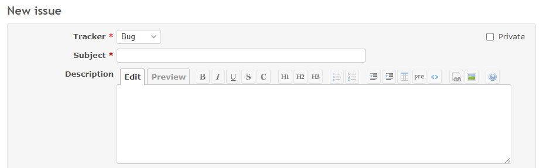
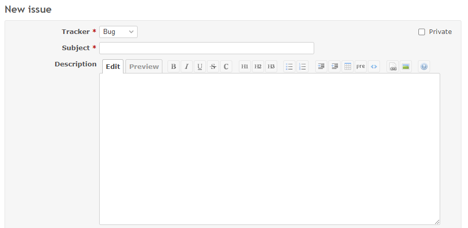

# Change the height of the description textarea

Change the height of the description textarea.  
説明欄のテキストエリアの高さを変更します。

## Setting

### Path Pattern

None

### Insert Position

Head of all pages
<!-- 
Head of all pages
Bottom of issue form
Bottom of issue detail
Bottom of all pages
-->

### Code

CSS
<!--
JavaScript
CSS
HTML
-->

```css
#issue_description {
  height: 300px;
}
```

## Result

### Before



### After



