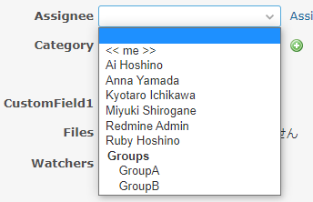
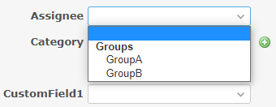

# Display only Group in Assignee

Display only Group in Assignee.  
担当者にグループのみを表示します。

## Setting

### Path Pattern

None

### Insert Position

Bottom of issue form
<!-- 
Head of all pages
Bottom of issue form
Bottom of issue detail
Bottom of all pages
-->

### Code

JavaScript
<!--
JavaScript
CSS
HTML
-->

```javascript
$(function() {
  // Remove users
  $('#issue_assigned_to_id>option:not([value=""])').remove();

  // Hide "Assign to me" link
  $('a.assign-to-me-link').remove();
})
```

## Result

### Before



### After



