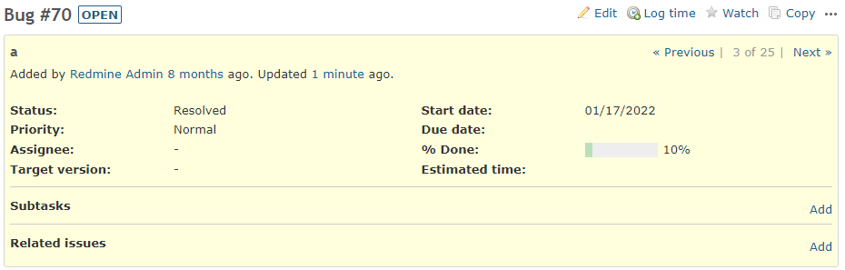
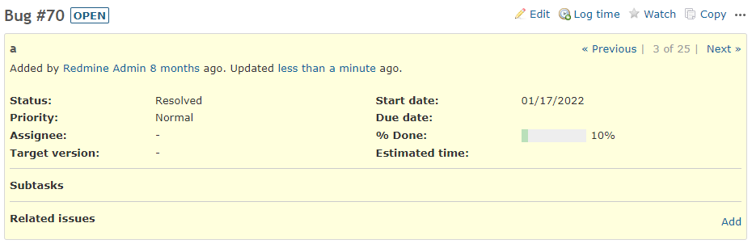

# Hide Add link in Subtask according to status

Hide Add link in Subtask according to status.  
ステータスに応じて子チケットの追加リンクを非表示にします。

In this example, it is hidden when the status ID is 3.  
この例では、ステータスIDが3の時に非表示にしています。

## Setting

### Path Pattern

None

### Insert Position

Bottom of issue detail
<!-- 
Head of all pages
Bottom of issue form
Bottom of issue detail
Bottom of all pages
-->

### Code

CSS
<!--
JavaScript
CSS
HTML
-->

```css
div.issue.status-3 #issue_tree a[href*="issues/new"] {
  display: none;
}
```

## Result

### Before



### After



