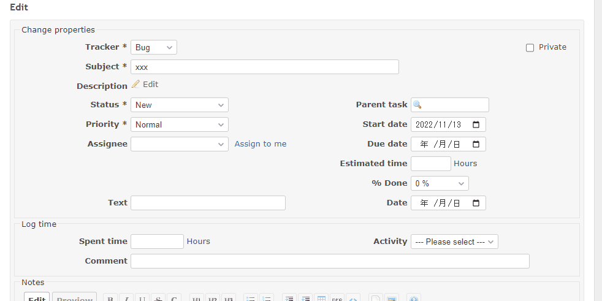

# Set the current date and time in a custom field when the status is changed 

Set the current date and time in a custom field when the status is changed.  
ステータスを変更したらカスタムフィールドに現在日時を設定します。

In this example, when the status ID is `2`, the date format custom field is set to the current date, the custom field in text format is set to the current date and time.  
この例では、ステータスIDが`2`になった時に、日付形式のカスタムフィールドには現在日、テキスト形式のカスタムフィールドには現在日時を設定します。


## Setting

### Path Pattern

None

### Insert Position

Bottom of issue form
<!-- 
Head of all pages
Bottom of issue form
Bottom of issue detail
Bottom of all pages
-->

### Code

JavaScript
<!--
JavaScript
CSS
HTML
-->

```javascript
$(function () {

  const datetimeCustomField = $('#issue_custom_field_values_1'); // format: text
  const dateCustomField = $('#issue_custom_field_values_2');     // format: date

  $('#issue_status_id').on('change', function() {

    if ($('#issue_status_id').val() === '2') { // 2: In Progress
      
      const now = new Date();

      if (datetimeCustomField.val() === '') {
        datetimeCustomField.val(now.toLocaleString());
      }
      if (dateCustomField.val() === '') {
        dateCustomField.val($.datepicker.formatDate('yy-mm-dd', now));
      }
    }
  });
});
```

## Result


