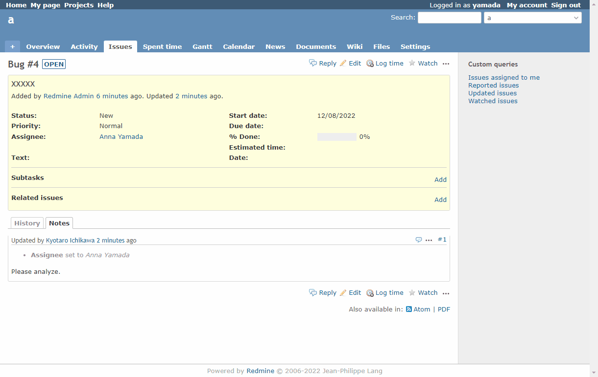

# Add a reply button

Add a reply button.  
返信ボタンを追加します。

Clicking the Reply button changes the member who last updated the issue to the assaignee.  
返信ボタンをクリックすると、チケットを最後に更新したメンバーが担当者に変更されます。

View customize version 3.2.0 or higher is required to run this code.  
このコードの実行には、View customizeのバージョン3.2.0以上が必要です。

## Setting

### Path Pattern

None

### Insert Position

Bottom of issue detail
<!-- 
Head of all pages
Bottom of issue form
Bottom of issue detail
Bottom of all pages
-->

### Code

JavaScript
<!--
JavaScript
CSS
HTML
-->

```javascript
$(function () {
  const beforeAssignedTo = $('#issue_assigned_to_id').val();

  $('#content > .contextual a.icon-edit').each((index, element) => {
    const edit = $(element);
    const reply = $('<a>')
                    .addClass('icon icon-reply')
                    .text('Reply')
                    .attr('href', edit.attr('href'));
    edit.before(reply);

    reply.on('click', () => {
      let replyTo; 
      if (ViewCustomize.context.issue.lastUpdatedBy) {
        replyTo = ViewCustomize.context.issue.lastUpdatedBy.id;
      } else {
        replyTo = ViewCustomize.context.issue.author.id;
      }
      $('#issue_assigned_to_id').val(replyTo);

      showAndScrollTo('update', 'issue_notes');
      return false;
    });

    edit.on('click', () => {
      $('#issue_assigned_to_id').val(beforeAssignedTo);
    });
  });
});
```

## Result


