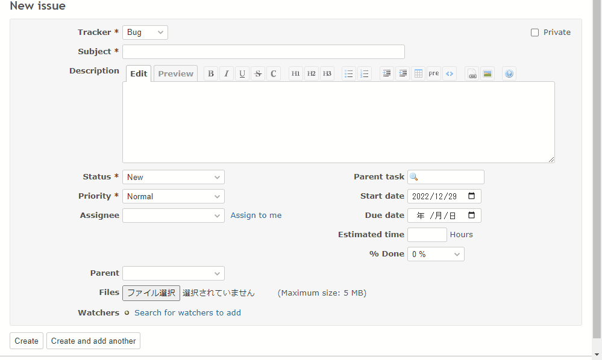

# Change the visibility of child custom field by value of the parent custom field

Change the visibility of child custom field by value of the parent custom field.  
親のカスタムフィールドの値に応じて、子のカスタムフィールドの表示/非表示を切り替えます。

## Setting

### Path Pattern

None

### Insert Position

Bottom of issue form
<!-- 
Head of all pages
Bottom of issue form
Bottom of issue detail
Bottom of all pages
-->

### Code

JavaScript
<!--
JavaScript
CSS
HTML
-->

```javascript
$(function() {

  // Note: Change the ID according to the custom field you want to target
  const parentField = $('#issue_custom_field_values_1');
  const childField = $('#issue_custom_field_values_2');

  const changeEnable = function() {

    const visible = parentField.val() == '1';

    if (visible) {
      childField.parent().show();
    } else {
      childField.parent().hide();
      childField.val('');
    }
  }

  parentField.change(changeEnable);

  changeEnable();
})
```

## Result


